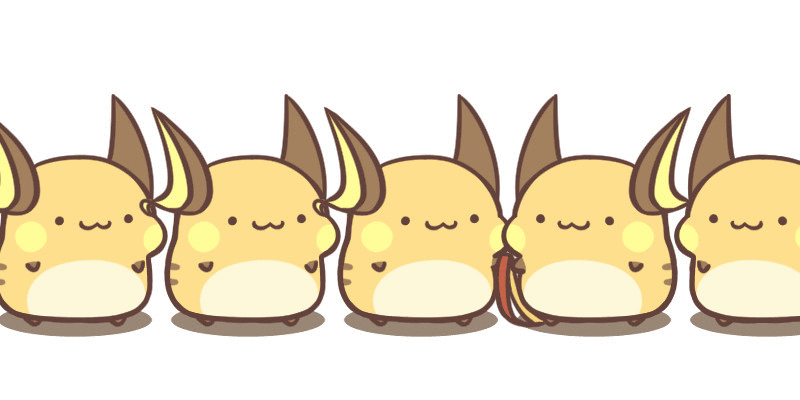

<h1 align="center">Hi, I'm a developer girl 	(｡•̀ᴗ-)✧</h1>
<h3 align="center">Backend developer | Frontend developer</h3>

	

  

&nbsp;***Talking about Personal Stuffs...***

✔ My main developing language is **PHP** with **Laravel framework** 
✔ Now I'm learning about **Wordpress** 
✔ I’m also learning **VueJS** & **NodeJS** 
✔ I’m love learning about **pure CSS** and **minimize using JS** 
✔ I’m looking for help for learning **ThreeJS** 
✔ And **CSS animation** 
✔ I have some skills with **Adobe Illustrator (AI)** and adobe **After effect (AE)** 
✔ And obviuosly, I'm interested in Pikachu ϞϞ(๑⚈ ․̫ ⚈๑) 
✔ And also, I'm a cat lover (｡>︿<｡)  

 

### 🔥 My contribution streak

  

### ⚙️ &nbsp;GitHub Analytics

  

 

### 🌱 &nbsp;My page

You can take a look for my technical learning content at: https://viblo.asia/u/bunny.pi.green

And my website: https://tothemoon-min.com/

